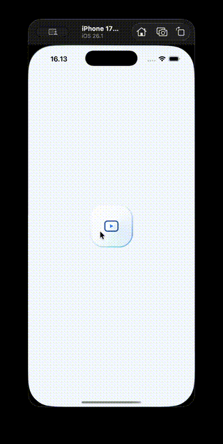
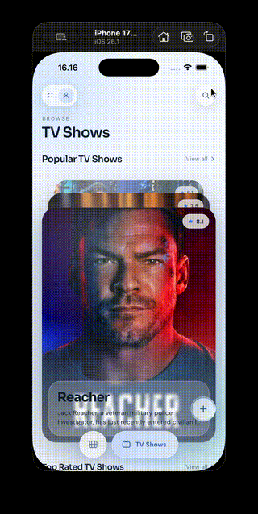

# CineCatalog

A movie, TV show and people catalog for iOS and Android, powered by the
[TMDB API](https://developer.themoviedb.org/reference).

Built with **Flutter 3.47.5 (stable)** and **Dart 3.13.4**, using Riverpod,
Dio and clean architecture.

## Demo

<table>
  <tr>
    <td align="center"></td>
    <td align="center"></td>
  </tr>
</table>

## Features

- Movies and TV shows: a swipeable card deck, rails, and 8 "View all" lists
  with infinite scroll
- Detail pages for movies, shows and people, with trailers that play inside
  the app
- Search across movies, shows and people, plus a people-only search
- A watchlist saved on the device: tap the heart on a detail page or swipe a
  list row left to add a title
- Skeleton loading, empty and error states with retry on every screen

## Screens

| Screen | How to get there | What it shows |
| --- | --- | --- |
| **Splash** | App start | Animated logo and "Powered by TMDB", then onboarding (first launch) or home |
| **Onboarding** | First launch only | Three intro slides with Skip / Next / Get started |
| **Home: Movies / TV Shows** | Bottom nav | Search button, a swipeable card deck (top rated movies / popular shows) and three rails (upcoming, now playing, popular / top rated, on the air, airing today) |
| **View all** | "View all" on the deck or a rail | The full list with infinite scroll; swipe a row left to add it to the watchlist |
| **Movie detail** | Tap a movie | Poster, genres, overview, rating, runtime, status, tagline, cast, similar movies, Play (trailer plays in the app), watchlist heart |
| **TV detail** | Tap a show | Poster, genres, overview, rating, episodes, status, network, seasons, cast, similar shows, Play (trailer plays in the app), watchlist heart |
| **Person detail** | Tap a person or cast member | Photo, department, birthday, place of birth, biography, known for |
| **Search** | Search button on home | Search across movies, shows and people with filters; today's trending titles as suggestions |
| **Popular People** | FAB menu | Grid of popular people with its own people-only search |
| **Watchlist** | FAB menu | Saved movies and shows; swipe a row left to remove it; empty state when nothing is saved |

## Requirements coverage

| Requirement | Where it is implemented |
| --- | --- |
| Splash screen | Splash screen on every launch (`features/onboarding/presentation/pages/splash_page.dart`) |
| Loading status while data loads | Shimmer skeletons shaped like the content on every screen, plus a spinner in the list footer while the next page loads |
| Lists in an attractive UI/UX | Card deck, poster rails, paginated lists and grids in a light "liquid glass" design with animations |
| Search (bonus) | Search page (movies, shows, people with filters) and a people-only search on Popular People |
| Rating or add to watchlist | Both: TMDB ratings on every card, row and detail page, and a watchlist that survives app restarts |
| GitHub docs on installing and running | This README: [Setup](#setup), [Configuration](#configuration), [API](#api) and [Flutter Test](#flutter-test) |

## Prerequisites

| Tool | Version |
| --- | --- |
| Flutter | 3.47.5 (stable), pinned in `.fvmrc` |
| Dart | 3.13.4 (comes with Flutter) |
| TMDB | An "API Read Access Token" from [TMDB → Settings → API](https://www.themoviedb.org/settings/api) |

## Setup

### 1. Add your TMDB token

```sh
cp .env.example .env
```

Open `.env` and paste your token into `TMDB_TOKEN`. The file is git-ignored.

### 2a. With FVM (recommended)

[FVM](https://fvm.app) installs the exact Flutter version this project uses.

```sh
fvm install
fvm flutter pub get
fvm dart run build_runner build --delete-conflicting-outputs
fvm flutter run
```

### 2b. Without FVM

Make sure `flutter --version` shows **3.47.5**, then:

```sh
flutter pub get
dart run build_runner build --delete-conflicting-outputs
flutter run
```

> `build_runner` reads `.env` and generates `lib/core/config/env.g.dart`
> (git-ignored). Run it again whenever you change `.env`.

In VS Code, the **CineCatalog (dev)** launch configuration runs the app with no
extra setup.

## Configuration

All settings live in `.env`.

| Key | Default | What it does |
| --- | --- | --- |
| `TMDB_TOKEN` | – | TMDB access token (required). Obfuscated in the build. |
| `TMDB_LANGUAGE` | `en-US` | Language of titles and overviews |
| `TMDB_REGION` | – | Country for movie release dates, e.g. `ID` |
| `APP_ENV` | `dev` | `dev`, `staging` or `prod`. Only `dev` debug builds turn on the Chucker HTTP inspector; release builds never include it. |

For QA, `--dart-define=INITIAL_ROUTE=/movie/27205` opens the app straight on a
page.

## API

All data comes from **[The Movie Database (TMDB) API v3](https://developer.themoviedb.org/reference)**
(`https://api.themoviedb.org/3`), authenticated with a Bearer "API Read
Access Token". Images come from TMDB's image CDN (`https://image.tmdb.org/t/p/`).
Trailers are YouTube videos listed by TMDB. They play inside the app; the few
whose owners block embedding offer "Watch on YouTube" instead.

| Screen | Endpoints |
| --- | --- |
| Movies | `GET /movie/top_rated`, `/movie/upcoming`, `/movie/now_playing`, `/movie/popular` |
| TV shows | `GET /tv/popular`, `/tv/top_rated`, `/tv/on_the_air`, `/tv/airing_today` |
| Movie detail | `GET /movie/{id}?append_to_response=credits,videos,similar` |
| TV detail | `GET /tv/{id}?append_to_response=credits,videos,similar` |
| Popular People | `GET /person/popular`, `GET /search/person` |
| Person detail | `GET /person/{id}?append_to_response=combined_credits` |
| Search | `GET /search/multi`, `GET /trending/all/day` (suggestions) |

The watchlist does not use the API: it is stored on the device.

## Architecture

Each feature (`movie`, `tv`, `people`, `search`, `watchlist`) is split into
three layers. A page asks its notifier for data; the notifier calls a use case,
which goes through a repository to TMDB (or, for the watchlist, the device).

| Layer | Folder | What it does |
| --- | --- | --- |
| Presentation | `features/*/presentation` | Pages, widgets, notifiers and their states |
| Domain | `features/*/domain` | Entities, repository interfaces, use cases (pure Dart) |
| Data | `features/*/data` | Models (JSON), data sources and repository implementations |
| Core | `lib/core` | Shared network client, paging, theme and widgets |

### How the main pieces work

| Piece | In short |
| --- | --- |
| **States** | Every request has its own states, e.g. `MovieDetailLoading` → `MovieDetailLoaded` or `MovieDetailError`. Pages show a skeleton, the content, an empty state or an error card. |
| **ApiClient** | One Dio client for all of TMDB. It adds the token, retries when TMDB rate-limits (HTTP 429), and shows a toast when a request fails. |
| **Errors** | Network errors become a `Failure` (no connection, not found, server error, …), so pages never deal with Dio directly. |
| **Pagination** | All lists load the next page at 80% scroll, one request at a time, up to TMDB's limit of 500 pages. |
| **Watchlist** | Saved as JSON in `SharedPreferences`, so it survives restarts. Only uninstalling the app or clearing its data removes it. |

### Tech stack

| Purpose | Package |
| --- | --- |
| State management | `flutter_riverpod` 3 |
| HTTP | `dio` 5, `chucker_flutter` (dev inspector) |
| Error handling | `fpdart` (`Either<Failure, T>`) |
| Routing | `go_router` |
| Config and secrets | `envied` (reads `.env`) |
| Images | `cached_network_image` |
| Trailers | `youtube_player_iframe`, `url_launcher` (YouTube fallback) |
| Local storage | `shared_preferences` |
| Tests | `flutter_test`, `mocktail` |

## Project structure

```
lib/
├── core/          # config, network, error, state (paging), theme, widgets
├── features/
│   ├── home/      # home tabs, deck, rails, View all lists
│   ├── movie/
│   ├── tv/
│   ├── people/
│   ├── search/
│   ├── watchlist/
│   └── onboarding/
└── router/        # routes and GoRouter setup
```

## Flutter Test

```sh
fvm flutter test
fvm dart analyze    # must report no issues
```

Without FVM, drop the `fvm` prefix. The tests cover the network client, JSON
models, repositories, notifiers and the main screens, using stub repositories,
so they need no token or network.

## Credits

<a href="https://www.themoviedb.org/"></a>

Movie, TV and people data and images are provided by
[The Movie Database (TMDB)](https://www.themoviedb.org/).
This product uses the TMDB API but is not endorsed or certified by TMDB.

Fonts (Sora, DM Sans) are bundled under `assets/fonts` and licensed under the
SIL Open Font License.
